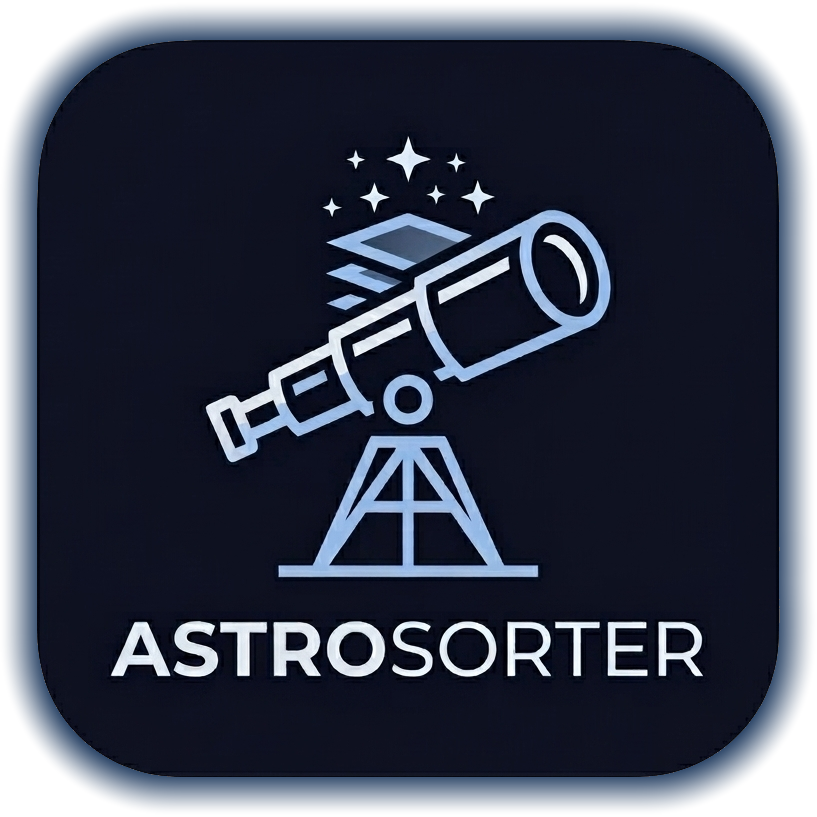

# 🔭 AstroSorter

<div align="center">




[](https://opensource.org/licenses/MIT)
[](https://www.python.org/)
[](https://www.microsoft.com/)

**Automatic Astrophotography Image Classifier**

Sort your astrophotography images into calibration types (Lights, Darks, Flats, Biases) with AI-powered accuracy.

[Features](#-features) • [Installation](#-installation) • [Usage](#-usage) • [Supported Formats](#-supported-formats) • [Contributing](#-contributing)

</div>

---

## ✨ Features

### 🤖 Smart Classification
- **Automatic Detection**: Classifies images into Lights, Darks, Flats, Biases, and Flat-Darks automatically
- **Metadata Analysis**: Reads FITS headers and EXIF data for accurate classification
- **Image Statistics**: Falls back to image analysis when metadata is insufficient
- **Filename Patterns**: Recognizes common astrophotography filename conventions

### 📊 Supported Camera Brands
- **Canon**: CR2, CR3, CRW
- **Nikon**: NEF, NRW
- **Sony**: ARW, SR2, SRF
- **Fujifilm**: RAF
- **Adobe**: DNG
- **Olympus**: ORF
- **Panasonic**: RW2
- **Pentax**: PEF
- And many more RAW formats...

### 🖥️ AAA-Level User Interface
- **Modern Dark Theme**: Cosmic-inspired design with deep space colors
- **Browse Folder**: Click to select your image folder
- **Real-time Progress**: See classification progress in real-time with percentage, elapsed time, and ETA
- **Detailed Metadata**: View EXIF/FITS metadata for each image
- **Export Options**: Copy or move files to organized folders

### 📁 File Support
- RAW files (Canon, Nikon, Sony, Fujifilm, etc.)
- FITS files (FITS, FIT, FTS)
- TIFF files
- JPEG/PNG files

---

## 🖥️ Installation

### Prerequisites

- **Python 3.10 or higher**
- **Windows 10/11** (Standalone executable available)

### Install from Source

```bash
# Clone the repository
git clone https://github.com/Fafiew/AstroSorter.git
cd AstroSorter

# Create virtual environment (recommended)
python -m venv venv

# Activate virtual environment
venv\Scripts\activate

# Install dependencies
pip install -r requirements.txt

# Run the application
python -m AstroSorter.main
```

### Requirements

```
customtkinter>=5.2.0
Pillow>=10.0.0
numpy>=1.24.0
rawpy>=0.18.0
scikit-image>=0.21.0
tqdm>=4.65.0
darkdetect>=0.8.0
psutil>=5.9.0
astropy>=5.3.0
```

### Build Executable

```bash
# Install PyInstaller
pip install pyinstaller

# Build Windows executable using the spec file (recommended)
pyinstaller AstroSorter.spec

# Or build without spec file (may require manual hidden imports)
pyinstaller --name=AstroSorter --windowed --onefile --hiddenimport=customtkinter --hiddenimport=PIL --hiddenimport=rawpy --hiddenimport=numpy --hiddenimport=skimage --hiddenimport=tqdm --hiddenimport=darkdetect --hiddenimport=psutil AstroSorter/main.py
```

The executable will be created in the `dist/AstroSorter` folder.

---

## 🚀 Usage

### Getting Started

1. **Launch AstroSorter**
   ```bash
   python -m AstroSorter.main
   ```
2. **Click the Browse Folder** button or use the drop zone
3. **Select a folder** containing your astrophotography images
4. **Wait** for the classification to complete
5. **Review** the results in the file table
6. **Export** the sorted files to your desired location

### Classification Types

| Type | Description | Typical Characteristics |
|------|-------------|------------------------|
| 🌟 **Lights** | Main astrophotography exposures | Long exposure (>10s), contains target object |
| 🌙 **Darks** | Dark frames for noise reduction | Long exposure, no object, taken with lens cap on |
| ☀️ **Flats** | Flat field frames | Short exposure, taken against uniform light source |
| 📊 **Bias** | Bias frames for read noise | Zero or very short exposure (<0.01s) |
| 🔲 **Flat-Darks** | Dark frames for flat calibration | Short dark exposures matched to flat exposures |

### Export Options

- **Copy**: Keeps original files in place
- **Move**: Relocates files to sorted folders
- **JSON Report**: Generates detailed classification report
- **Rename**: Custom filename pattern ({type}_{#}, {type}_{exposure}s_{#}, etc.)

---

## 📋 Supported Formats

### RAW Formats

| Brand | Extensions | Support |
|-------|------------|---------|
| Canon | .cr2, .cr3, .crw | ✅ Full |
| Nikon | .nef, .nrw | ✅ Full |
| Sony | .arw, .sr2, .srf | ✅ Full |
| Fujifilm | .raf | ✅ Full |
| Adobe DNG | .dng | ✅ Full |
| Olympus | .orf | ✅ Full |
| Panasonic | .rw2 | ✅ Full |
| Pentax | .pef | ✅ Full |
| Generic | .raw | ✅ Basic |

### Other Formats

| Format | Extensions | Support |
|--------|------------|---------|
| FITS | .fit, .fits, .fts | ✅ Full |
| TIFF | .tif, .tiff | ✅ Full |
| JPEG | .jpg, .jpeg | ✅ Basic |
| PNG | .png | ✅ Basic |

---

## 🔧 How It Works

### Classification Algorithm

1. **Metadata First**: Reads FITS headers (IMAGETYP, EXPTIME, FILTER, etc.) and EXIF data
2. **Filename Analysis**: Checks for common naming patterns (dark_, flat_, bias_, light_)
3. **Image Statistics**: Falls back to analyzing image properties (mean, std, histogram)

### Key Detection Criteria

```
BIAS:  Exposure ≤ 0.01s
FLAT:  0.01s < Exposure ≤ 10s + Filter present
LIGHT: Exposure > 10s + Object name present
DARK:  Exposure > 10s + No object name
```

---

## 📁 Project Structure

```
AstroSorter/
├── AstroSorter/
│   ├── __init__.py          # Package initialization
│   ├── main.py              # Main application entry
│   ├── classifier.py        # Core classification engine
│   └── ui_components.py     # UI components and theme
├── assets/                  # Application assets
├── SPEC.md                  # Detailed specification
├── README.md                # This file
├── LICENSE                  # MIT License
└── pyproject.toml           # Python project configuration
```

---

## 🤝 Contributing

Contributions are welcome! Please feel free to submit a Pull Request.

### Development Setup

```bash
# Clone and setup
git clone https://github.com/Fafiew/AstroSorter.git
cd AstroSorter

# Install dev dependencies
pip install -e ".[dev]"

# Run tests
pytest

# Format code
black AstroSorter/

# Type checking
mypy AstroSorter/
```

---

## 📄 License

This project is licensed under the MIT License - see the [LICENSE](LICENSE) file for details.

```
MIT License

Copyright (c) 2024 AstroSorter

Permission is hereby granted, free of charge, to any person obtaining a copy
of this software and associated documentation files (the "Software"), to deal
in the Software without restriction, including without limitation the rights
to use, copy, modify, merge, publish, distribute, sublicense, and/or sell
copies of the Software, and to permit persons to whom the Software is
furnished to do so, subject to the following conditions:

The above copyright notice and this permission notice shall be included in all
copies or substantial portions of the Software.

THE SOFTWARE IS PROVIDED "AS IS", WITHOUT WARRANTY OF ANY KIND, EXPRESS OR
IMPLIED, INCLUDING BUT NOT LIMITED TO THE WARRANTIES OF MERCHANTABILITY,
FITNESS FOR A PARTICULAR PURPOSE AND NONINFRINGEMENT. IN NO EVENT SHALL THE
AUTHORS OR COPYRIGHT HOLDERS BE LIABLE FOR ANY CLAIM, DAMAGES OR OTHER
LIABILITY, WHETHER IN AN ACTION OF CONTRACT, TORT OR OTHERWISE, ARISING FROM,
OUT OF OR IN CONNECTION WITH THE SOFTWARE OR THE USE OR OTHER DEALINGS IN THE
SOFTWARE.
```

---

## 🙏 Acknowledgments

- [Astropy](https://www.astropy.org/) - For FITS file handling
- [DeepSkyStacker](https://deepskystacker.com/) - For classification reference
- [CustomTkinter](https://github.com/TomSchimansky/CustomTkinter) - For modern UI components
- [rawpy](https://github.com/letmaik/rawpy) - For RAW file support

---

<div align="center">

**Made with 🔭 for astrophotographers everywhere**

[Back to Top](#-astrosorter)

</div>
